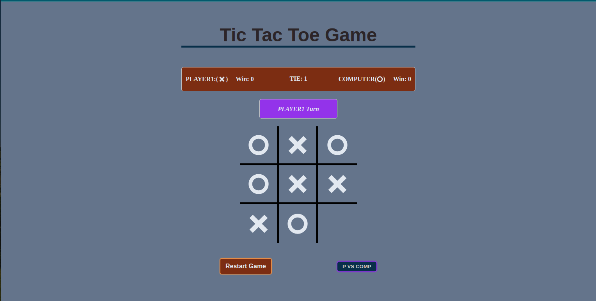

# tic-tac-toe

# Project Description:

-    In this project, famous tic tac toe game is built using html, css and vanilla JS.
-    Javascript coding is built using factory functions and modules to make coding more clean and easier readibility and encapsulation of the code.
-    In this tic tac toe game we have two playing modes:

### Player vs Player Mode(P VS P):

-    In this mode two players play against each other.
-    Their progress is displayed at the top of the game board.

### Player vs Comp Mode(P vs COMP):

-    As it is clear from the mode name in this mode a human plays againt AI.
-    AI is built using famous [minmax algorithm](https://en.wikipedia.org/wiki/Minimax) to make it unbeatable.
     <!-- 

       
       <a href="https://full-stackninja.github.io/tic-tac-toe/">Play Game Here</a>
     
 -->
     |  |  [Play Game Here](https://full-stackninja.github.io/tic-tac-toe/)  |
     | ---------------------------------------------------------------------------------- | ------------------------------------------------------------------------------------------------------- |

# Screen Shot:

